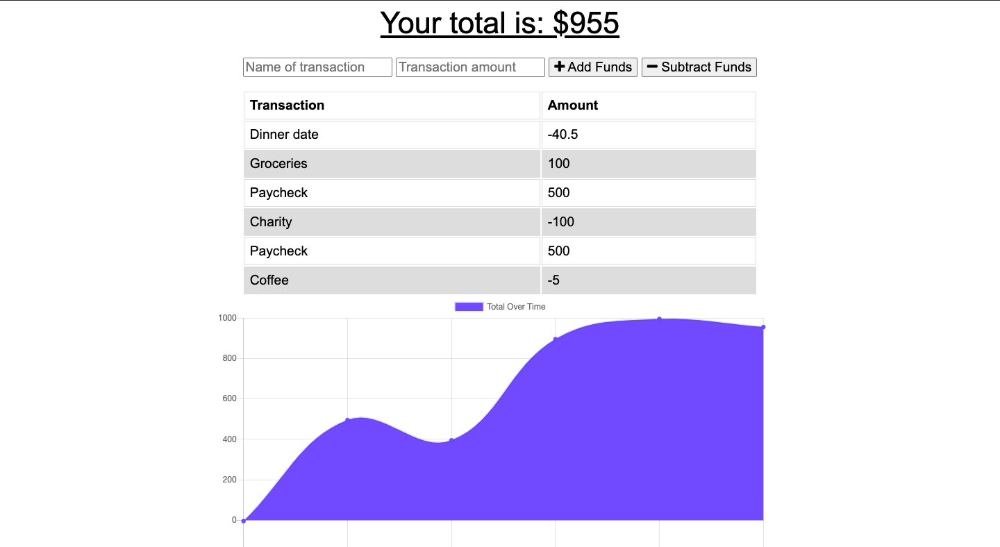

<h1 align="center">PWA-Budget-Tracker</h1>
  

    
    
    

  

    
    
    
    
    
    
    
    
    

## Description 

This app is a Progressive Web Application (PWA) which allows you to track your budget.

## Screenshot

## Deployed on Heroku

[Deploy Live on Heroku](https://frozen-forest-39139.herokuapp.com/)

## Table of Contents
* [Technologies](#technologies)
* [Installation](#installation)
* [Credits](#credits)

## Technologies
- Node.js
- NoSQL Database: MongoDB
- ORM: Mongoose
- Express
- Compression

## Installation
- npm install
- npm i mongoose express compression

## Credits
- Trilogy Course Material, Instructor, TAs, Classmates

## Contributors
- [1jorcarver | Jordan Carver](https://github.com/1jorcarver)
- [xandromus | Xander Rapstine | Author](https://github.com/Xandromus)